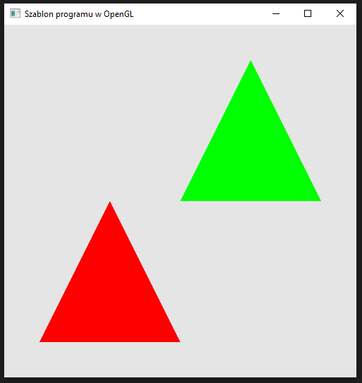

### Zadanie 1

Napisz program, który wyświetla na ekranie dwa trójkąty o różnych kolorach, które nachodzą na siebie. Czy będzie widać wtedy tylko jeden, a jeśli tak to który? Czy może będą się przenikały, a jeśli to w jaki sposób? Zrób oczywiście zrzut ekranu oraz dołącz plik readme z opisaniem wyniku oraz próbą wyjaśnienia co się w takiej sytuacji dzieje.

#### Wynik

Na screenie widać dwa trójkąty w różnych kolorach.