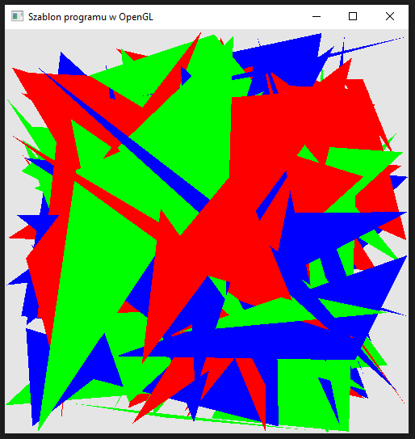

### Zadanie 2

Napisz program, który wyświetla na ekranie N=100 losowo wygenerowanych trójkątów (użyj parametru N, który można zmieniać w kodzie programu). Skorzystaj ze zmiennych gl_PrimitiveID oraz gl_FragCoord w shaderze fragmentów, aby trójkąty nie miały tego samego koloru oraz aby kolor ich fragmentów był uzależniony od pozycji w oknie aplikacji.

#### Wynik

Na screenie widać kolejne trójkąty które są rysowane jeden na drugim.