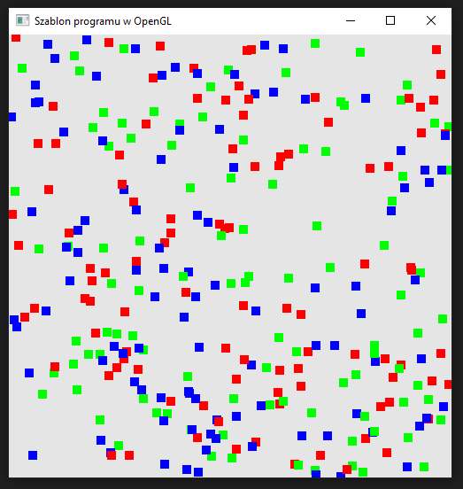

### Zadanie 3

Skorzystaj z poprzedniego programu i napisz nowy, który generuje wiele losowych punktów na ekranie o różnym kolorze oraz różnym rozmiarze. Aby kontrolować rozmiar punktów:

- na etapie inicjalizacji (w etapie (4) funkcji Initialize) uaktywnij taką możliwość za pomocą komendy glEnable(GL_PROGRAM_POINT_SIZE);
- w shaderze wierzchołków ustaw rozmiar punktów (np. gl_PointSize = 10.0f;)

#### Wynik

Na screenie widać 100 punktów o rozmiarzee 10.0f.