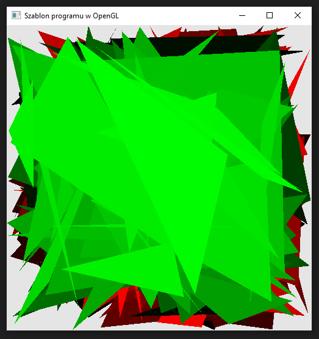

### Zadanie 4

Napisz program, który tworzy dwa różne dowolne potoki graficzne OpenGLa (np. niech jeden wyświetla trójkąty w różnych odcieniach czerwieni, a drugi w różnych odcieniach zieleni). W tym celu stwórz oddzielny vertex i fragment shader (np. vertex-2.glsl itp). Wykorzystaj Zadanie 2 i spraw, aby część trójkątów wyświetla się za pomocą jednego potoku, a reszta za pomocą drugiego.

#### Wynik

Na screenie widać 100 trójkątów w kolorze czerwonym wyrenderowanych jednym potokiem oraz kolejne 100 zielonych trójkatów wyrenderowanych drugim potokiem.