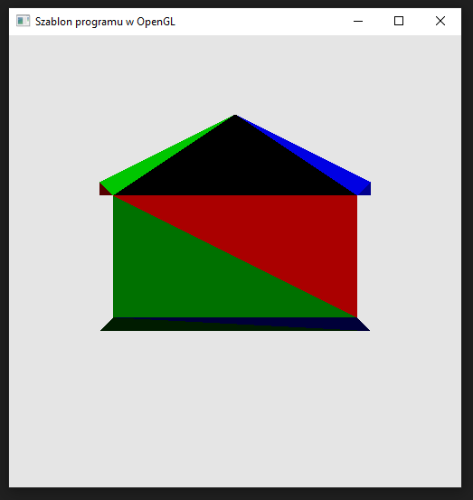

### Zadanie 5

Napisz program, który wyświetla na ekranie domek wygenerowany w Blenderze i wyeksportowany do tablicy współrzędnych wierzchołków house.h. Popracuj nad shaderem fragmentów, aby domek ożył i wyglądał ciekawie (przykład). Wskazówki:

- Tablicę wierzchołków z pliku house.h skopiuj do swojego programu i potraktuj tak samo jak trójkąty w zadaniach z wykładu.
- Blender ma inny układ współrzędnych i może się okazać, że domek będzie odwrócony - jeśli tak, to poeksperymentuj ze współrzędnymi w vertex shaderze. Możesz tam dowolnie zmieniać ich kolejność.
- W shaderze fragmentów skorzystaj z gl_PrimitiveID oraz gl_FragCoord aby nadać inne kolory innym trójkątom.

#### Wynik

Na screenie widać wyrysowany kształt domu na bazie podanych wierzchołków. Każdy poligon składający się na dom jest w innym kolorze.