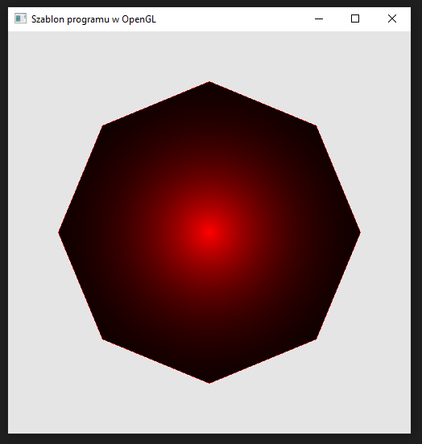

### Zadanie 6

Napisz program, który wyświetla ośmiokąt na ekranie w następujący sposób (przykład). Wskazówki:

- wylicz współrzędne kolejnych wierzchołków ośmiokąta ręcznie albo lepiej napisz własną pętlę, która je wylicza,
- niech środek ośmiokąta to punkt (0.0, 0.0),
- spraw, aby ośmiokąt był wypełniony radialnie,
- spraw, aby pojawiło się obramowanie.

#### Wynik

Na screenie widać ośmiokąt z czerwoną krawędzią czasnrym wypełnieniem oraz gradnientem który ma maksymalną wartość czerwoną w środku figury i słabnący przy krawędziach.
