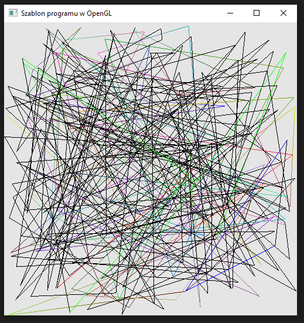
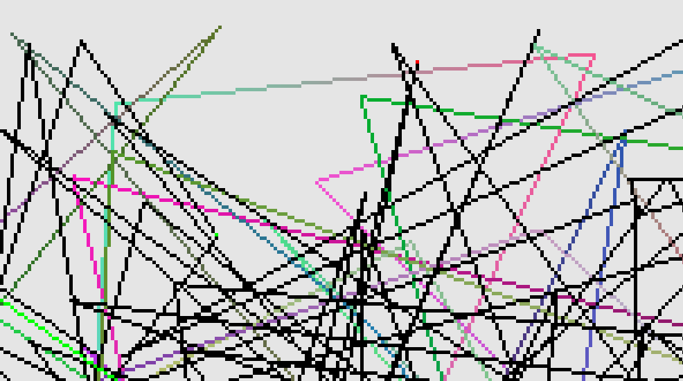
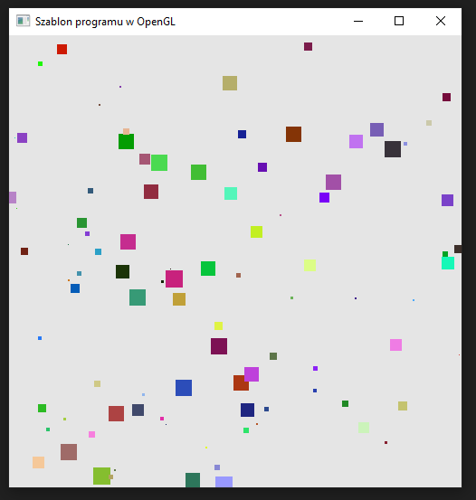

### Zadanie 1

Napisz program, który wyświetla na ekranie N=100 losowo wygenerowanych obiektów (użyj parametru N, który można zmieniać w kodzie programu). Skorzystaj ze zmiennych gl_PrimitiveID oraz gl_FragCoord w shaderze fragmentów, aby obiekty nie miały tego samego koloru oraz aby kolor ich fragmentów był uzależniony od pozycji w oknie aplikacji.

Warianty:

- A. Niech obiektami będą trójkąty ale bez środka - same krawędzie trójkątów w różnych kolorach.
- B. Niech obiektami będą punkty o różnym kolorze oraz różnym rozmiarze.
Wskazówki: Aby kontrolować rozmiar punktów: na etapie inicjalizacji (np. w funkcji Initialize) uaktywnij taką możliwość za pomocą instrukcji glEnable(GL_PROGRAM_POINT_SIZE), a następnie w shaderze wierzchołków w funkcji main ustaw rozmiar punktów (np. gl_PointSize = 10.0f;)

#### Wynik A

Na screenie widać obrysy trójkątów (krawędzie) z róznymi kolorami wierzchołków.

Poniżej zoom aby lepiej zobaczyć:

#### Wynik B

Na screenie widać różnego romziaru punkty w rózńych kolorach.