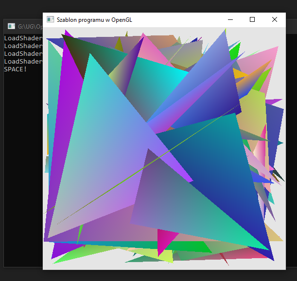
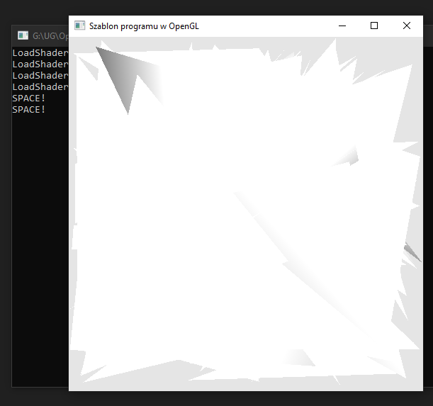

### Zadanie 2 

Napisz program, który tworzy dwa różne potoki graficzne OpenGLa: niech pierwszy generuje obiekty w różnych kolorach (można wykorzystać potok z poprzedniego zadania), a drugi niech rysuje obiekty w odcieniach szarości.

Warianty:

- A. Programy powinny być przełączane za pomocą klawisza SPACE, tzn. w danym momencie powinny się wyświetlać wszystkie obiekty za pomocą jednego programu, a po naciśnięciu klawisza, wszystkie obiekty powinny być wyświetlane za pomocą drugiego programu.
- B. Dokładnie połowa obiektów powinna być wyświetlana za pomocą jednego programu, a druga połowa za pomocą drugiego programu. Nie twórz dwóch tablic wierzchołków VAO, użyj jednej.

Wskazówki: Stwórz oddzielny vertex i fragment shader (np. vertex2.glsl oraz fragment2.glsl). Utwórz dodatkowy identyfikator w funkcji Initialize dla nowego programu oraz wykorzystaj go w DisplayScene.

#### Wynik A

Na screenie widać kolorowe trojkąty.

Po wciśnieciu spacji zostaje przełączony program na odcienie szarości:

Na screenie widać trojkąty w odcieniach szarości.

#### Wynik B

Na screenie widać że pierwsza część (połowa) figur jest rysowana pierwszym programem a na nich druga połowa drugim programem.