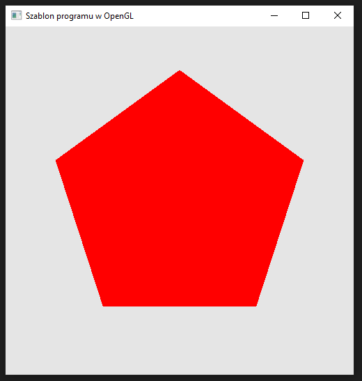
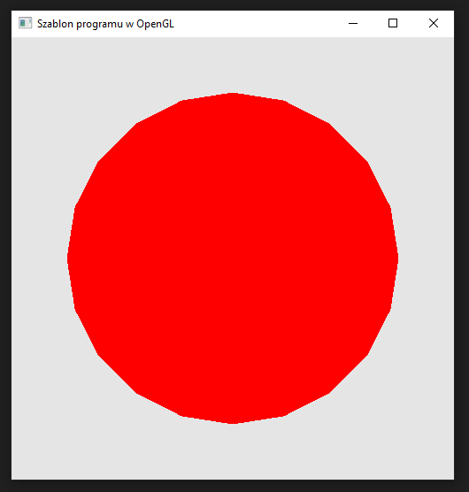

### Zadanie 4

Napisz program, który wyświetla N-kąt foremny na ekranie w następujący sposób: przykład dla N=8.

Wymagania:

- wylicz współrzędne kolejnych wierzchołków automatycznie za pomocą pętli (jest wiele metod, jedna z prostszych to obracanie punktu (1,0) za pomocą wzoru na obrót liczb zespolonych) i umieść w tablicy wierzchołków,
- niech środekiem ośmiokąta będzie punkt (0.0, 0.0),
- stwórz jeden potok, który renderuje ośmiokąt z wypełnieniem radialnym,
- stwórz drugi potok, który renderuje te same dane (z tej samej tablicy wierzchołków co wyżej) ale tylko jako obramowanie o odpowiedniej grubości (możesz wykorzystać funkcję glLineWidth),
- niech N będzie ustalone w jednym miejscu w kodzie, aby łatwo można było je zmieniać.

#### Wynik

Na screenie widać pięciokąt foremny.

Na screenie widać dwudziestokąt foremny.
