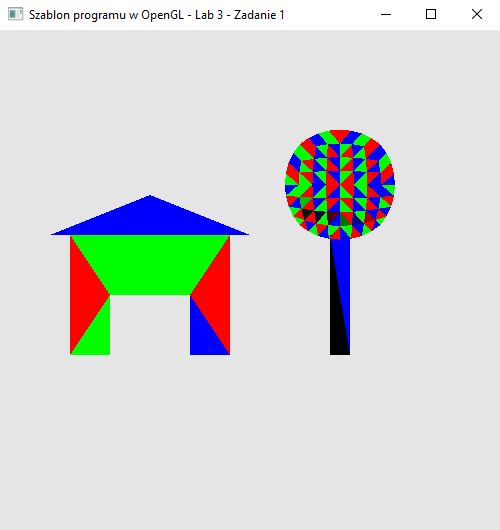

### Zadanie 1

Napisz program, który wyświetla na ekranie obiekt zapisany za pomocą wierzchołków oraz tablicy indeksów w pliku co-to-jest.h. Pokoloruj go dowolnie (użyj np. swojego programu kolorującego domek z poprzednich zajęć i sprawdź, jaki właściwie kształt ukryty jest w tych danych).

#### Wynik

Na screenie widać figure domu oaz drzewa wczytana przy pomocy tablicy indeksów (poukładane poligony)