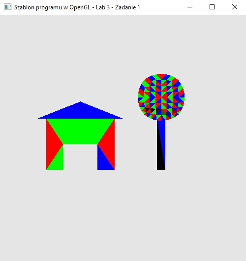

### Zadanie 2

Rozbuduj program z Wykładu obracający obiekt na ekranie względem osi X (klawisze W i S), osi Y (klawisze D i A) oraz Z (klawisze E i Q). Niech macierze obrotu będą obliczane na poziomie aplikacji i wysyłane jako zmienne uniform do potoku.

#### Wynik

Na screenie widać strukturę z Zadania 1 którą możn aobrazać za pomocą przycisków WSADQE