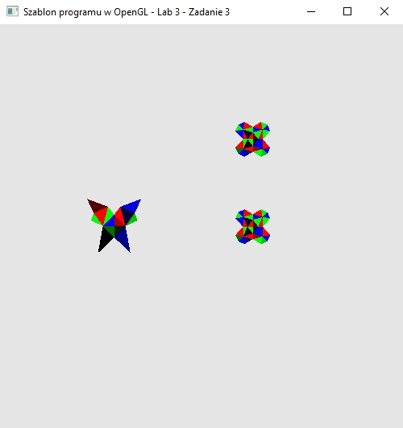

### Zadanie 3

Napisz program, który wyświetla trzy obiekty na ekranie z plików obiektA.h oraz dwie kopie obiektu obiektB.h w różnych miejscach sceny i o różnej wielkości. Obiekty zadane są tablicami indeksów. Niech program umożliwia modyfikowanie tych obiektów w następujący sposób:

- obraca obiektA względem osi Z klawiszami A i D,
- skaluje tylko jeden z obiektów obiektB klawiszami W i S.

Niech modyfikowanie obiektów odbywa się niezależnie, tzn. obracając jednym obiektem, drugi nie może ulegać zmianie.

#### Wynik

Obrót figury A za pomocą przycisków A i D, oraz skalowanie jednej z figur B za pomocą przycisków W, S.