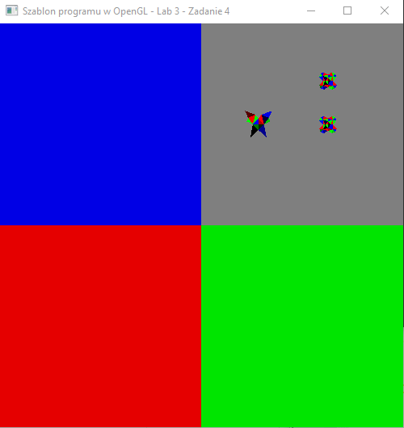

### Zadanie 4

Napisz program, który dzieli okno na cztery równe części i wyświetla w każdej z nich ten sam obiekt, ale w inny sposób. Użyj tylko jednego potoku graficznego, do którego wyślij zmienną jednorodną Mode, która przyjmuje wartość 0,1,2 lub 3 i w zależności od niej wyświetl obiekt w jakiś inny sposób. Skorzystaj z glViewport. Można rozwinąć zadanie domowe z poprzednich zajęć. Uwaga: uwzglednij zmianę rozdzielczości aplikacji tak, aby zawsze program dzielił okno na 4 równe obszary.

#### Wynik

Na screenie widać podzielone okno na 4 równe viewporty 3 w róznych kolorach oraz 4ty z sceną z poprzedniego zadania.