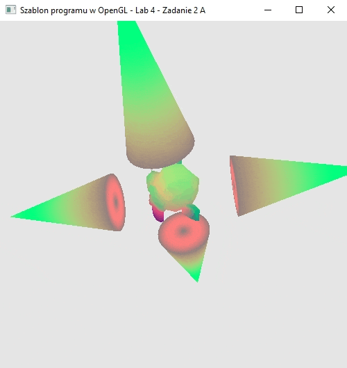
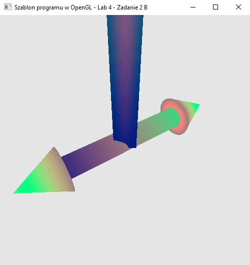

### Zadanie 2

Stwórz animację złożoną z kilku obiektów i jak najdokładniej odzwierciedlającą ich układ na scenie oraz sposób animacji wg następującego wariantu.

**Warianty:**

- A. wariant1.mp4 - cztery wydłużone stożki (cone.obj) obracające się wokół obracającej się na swój sposób małpki (monkey.obj)
- B. wariant2.mp4 - obracający się wydłużony torus (torus.obj) z dwoma stożkami na końcach (cone.obj), a całość przymocowana do wydłużonego prostopadłościanu (cube.obj), który się nie porusza

W tym zadaniu kolory obiektów nie mają znaczenia (może byleby nie były zupełnie jednolite). Wykorzystaj projekt objfile lub swój własny z możliwością oglądania animacji z różnych stron, przybliżania i oddalania. Zadbaj o czytelność kodu. Uwaga! Wykorzystaj jedynie podane w wariancie obiekty z katalogu models i nie twórz własnych. W przypadku, gdy na scenie pojawia się ten sam obiekt w różnych orientacjach, wykorzystaj macierze obrotu, aby go zorientować wg potrzeby. Za pomocą skalowania dokonaj ich wydłużenia i zmiany proporcji.

#### Wynik A

Na screenie widać obracjącą się głowę małpy (Suzan) a dookoła niej promieniście rozłożone obracające sie w przeciwnym kierunku cztery stożki

#### Wynik B

Na screenie widać obracjący się walec z dwoma stożkami na końcach który jest przymocowany do prostopadłościanu