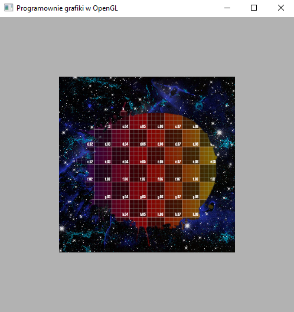

### Zadanie 1

Zmodyfikuj projekt first_texture z przykładów dodając drugi trójkąt w taki sposób, aby oba tworzyły kwadrat z nałożoną teksturą. Ustaw odpowiednio współrzędne UV wierzchołków, aby tekstura była poprawnie wyświetlana na całym kwadracie. Następnie dodaj dwie nowe tekstury do projektu i połącz wszystkie trzy w shaderze fragmentów w dowolny sposób (przykład). Wskazówka: użyj funkcji mix lub poeksperymentuj z dodawaniem wartości koloru kilku tekstur wg schematu 0.3*texA + 0.7*texB.

#### Wynik

Na screenie widać dwa trujkąty tworzące płaczszyczne (kwadrat) na który jest nakładana tekstura.