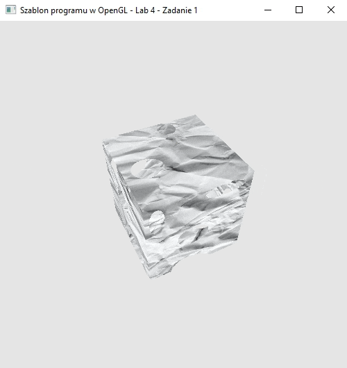

### Zadanie 2

Wyświetl na ekranie dowolny obiekt 3D (np. sześcian) z pliku OBJ, nałóż na niego teksturę z czerwonymi plamami (lub utwórz własną), a następnie wykorzystaj polecenie discard i spraw, aby obiekt w miejscach plam zrobił się dziurawy (przykład). Zauważ, że w tym zadaniu nie korzystamy jeszcze z kanału przezroczystości alpha.

#### Wynik

Na screenie widać oracający się sześcian z wyciątymi dziurami (czerwony kanał koloru)