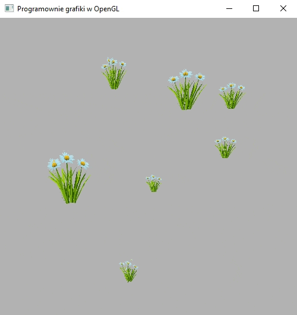

### Zadanie 3

Wyświetl na ekranie co najmniej 10 kopii tego samego obiektu z nałożoną teksturą przezroczystą (np. kwiatek z wykładu). Postaraj się unikać wczytywania wiele razy tego samego obiektu z pliku. Wykorzystaj jeden model oraz jedną tablicę wierzchołków VAO, a następnie stwórz tablicę/wektor różnych macierzy modelu, które sprawią, że ten sam obiekt zostanie wyświetlony w różnych miejscach sceny.

#### Wynik

Na screenie widać 10 randomowo ustawionych kwiatów zbudowanych z 2uch płaszczyżn przecinających się prostopadle w połowie.