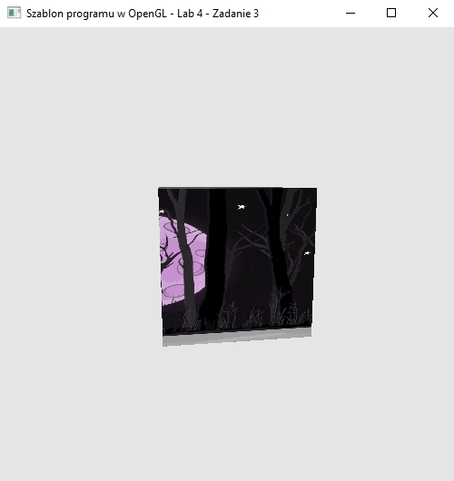
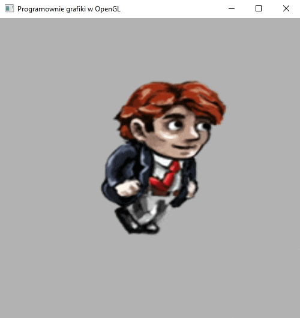

### Zadanie 4 A

Wyświetl na ekranie sześcian z pliku cube.h:

- który na bokach ma nałożoną podłużną teksturę (przykład tekstury) w następujący sposób,
- obiekt z pliku cube.h nie ma sam w sobie oddzielnych współrzędnych UV tekstury, ale możesz je sam dopisać lub wyliczyć wprost ze współrzędnych jego ośmiu wierzchołków (-1,-1,-1), (-1,-1,+1), aż do (+1,+1,+1),
- niech jego tekstura przesuwa się sama (animacja) dookoła sześcianu w następujący sposób.

Wskazówki: aby animować teksturę w ten sposób, można przesuwać jej współrzędne UV wierzchołków w shaderach powodując, że tekstura będzie mapowana z tym właśnie przesunięciem. Dodając do tego zmienną jednorodną time lub shift, która będzie aktualizowana po stronie aplikacji, spowodujemy, że ukaże nam się animacja tekstury.

#### Wynik A

Na screenie widać oracający się sześcian z animowaną teksturą

### Zadanie 4 B

Zaimplementuj tak zwaną animację sprite na obiekcie prostokąta (przykład). W tym celu:

- wykorzystaj dowolną teksturę złożoną z kolejnych klatek animacji sprite (przykład lub wyszukaj w google grafika),
- spraw aby w danej chwili wyświetlana na obiekcie była tylko jedna klatka animacji - dokonaj odpowiedniej modyfikacji współrzędnych UV.
- Jeśli wykorzystasz obraz z ciemnym tłem spróbuj pozbyć się tego tła jak na przykładzie, ale nie zmieniaj samej grafiki - zrób to za pomocą shaderów.

#### Wynik B

Na screenie widać animowaną teksturę z assetu 7x4 klatki