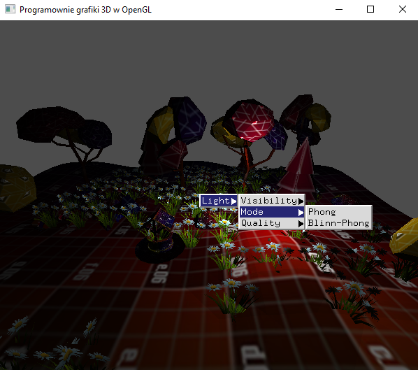

### Zadanie 1

Stwórz scenę z kilkoma różnymi obiektami, które mają nałożoną teksturę. Niech na scenie pojawią się obiekty, które się obracają i przesuwają - są one potrzebne do stwierdzenia poprawności implementacji oświetlenia.

- Zaimplementuj oświetlenie punktowe w cieniowaniu Phonga.
- Zaimplementuj oba modele światla odbiciowego: Phonga oraz Blinna-Phonga i dodaj opcję w menu kontekstowym do zmiany modelu.
- Niech każdy obiekt ma swój materiał (np. dołącz go do klasy CMesh)
- Spraw, aby na scenie pojawiły się obiekty błyszczące oraz matowe.
- Dodaj opcję menu kontekstowego, w którym można wybrać rendering uwzględniający oświetlenie oraz rendering bez używania oświetlenia.

Uwaga! Koniecznie uporządkuj i zorganizuj swój kod obiektowo zgodnie ze wskazówkami z poprzednich zajęć. To może być dobry początek budowania projektu końcowego. Implementacje modeli oświetlenia wykonaj zgodnie ze wzorami z treści wykładu.

#### Wynik

Na screenie widać oteksurowaną planszę oraz wygenerowane kwiatki. Dodane soztało menu kontekstowe pozwalające zmienić jakośc oświetlenia.

