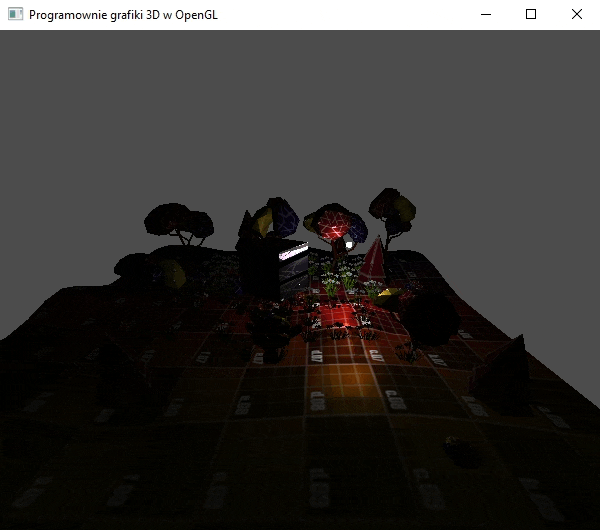
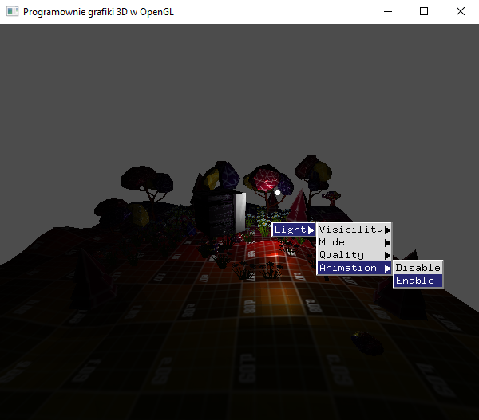

### Zadanie 2

Zaimplementuj w swoim projekcie światło punktowe, którego źródło się porusza (animacja) lub kierunkowe, którego kierunek się zmienia (animacja). Dodaj opcję w menu kontekstowym, która włącza animację światła i ją wyłącza.

#### Wynik

Dodano animacje światała (jego pozycji) na scenie.

