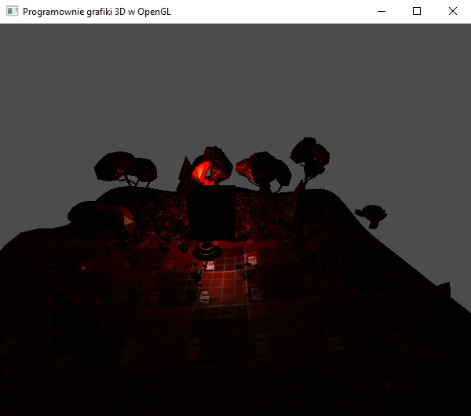

### Zadanie 3

Dla źródeł światła punktowego spraw, aby w ich położeniu pojawiały się małe sfery w kolorze składowej Diffuse wskazujące pozycję oraz kolor światła. Propozycja: użyj drugiego potoku, który nie uwzględnia oświetlenia, a tylko wyświetla obiekt w ustalonym kolorze (przykład z wykładu) lub tego samego potoku tylko dodaj zmienną jednorodną typu flaga do realizacji innego scenariusza w shaderze.

#### Wynik

Dodano reprecentacje koloru światła w osobnym porotku.