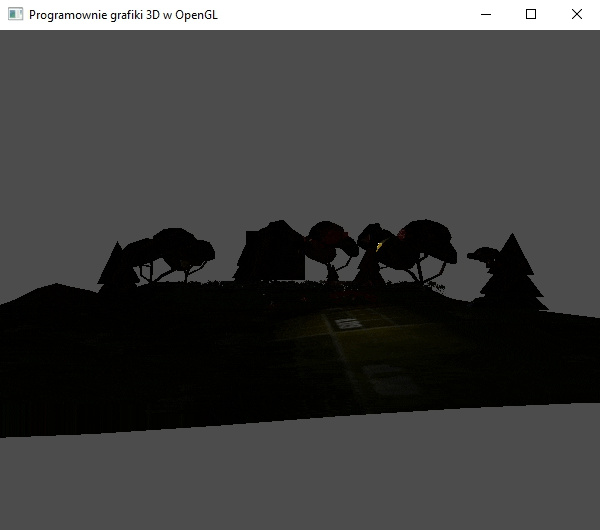
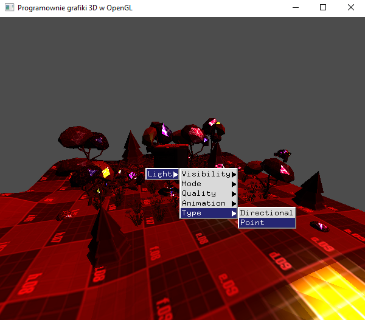

### Zadanie 4

Zaimplementuj w swoim projekcie światło kierunkowe oraz opcję zmiany oświetlenia z punktowego na kierunkowe za pomocą menu kontekstowego.

#### Wynik

Dodano możliwość przełączania typu oświetlenia.

