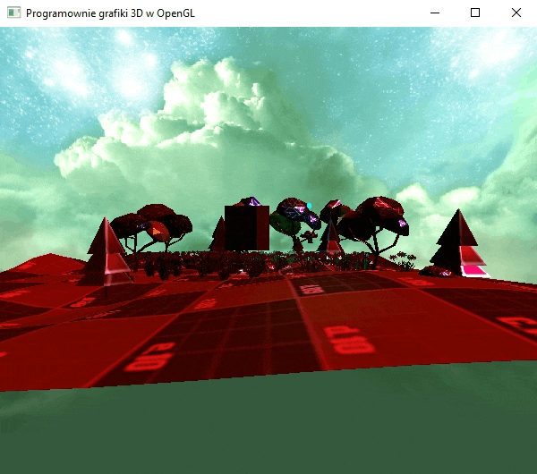
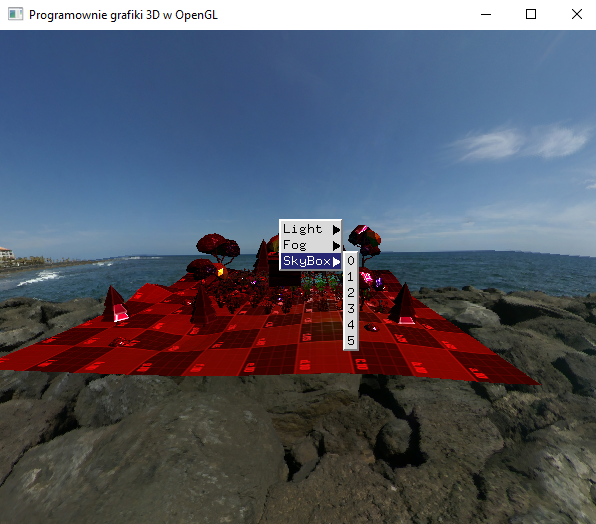

### Zadanie 1

Zaimplementuj w swoim projekcie SkyBox. Możesz wykorzystać tekstury umieszczone w katalogu skybox z przykładów lub inne. Do pełni szczęścia spraw, aby podczas działania programu była możliwość zmiany skyboxa spośród dwóch (lub więcej?) dostępnych skyboxów za pomocą menu kontekstowego. Możesz wykorzystać kod z pliku skybox.hpp, ale koniecznie zrefaktoryzuj go i napisz obiektowo. Na przykład stwórz klasę CSkyBox z odpowiednimi metodami do inicjalizacji oraz renderowania skyboxa.

#### Wynik

Na screenie widać scenę z zaimplementowanym skyboxem który można zmieniac za pomocą menu kontekstowego.

