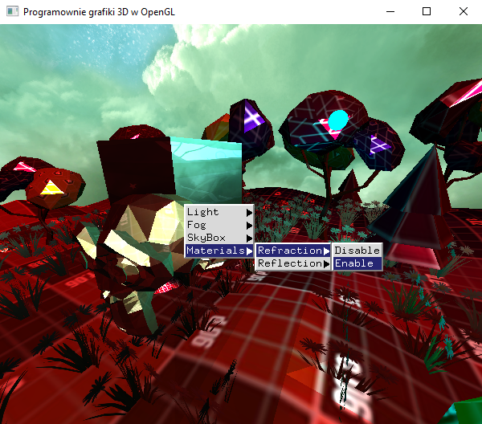
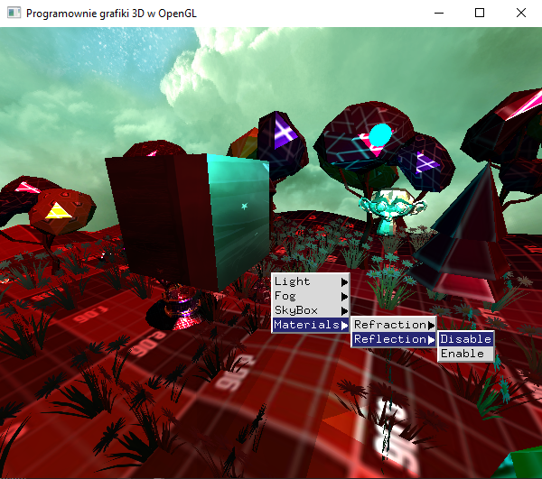

### Zadanie 2

Mając na scenie dowolny obiekt (lub obiekty), który się obraca i ma swoją teksturę rozwiń poprzednie zadanie ze SkyBoxem implementując na tym obiekcie odbicie i załamanie światła analogicznie do zadania wspólnego z zajęć. A może warto sprawić, aby jeden obiekt był tylko lustrzany a inny tylko przezroczysty? Dodaj możliwość włączania i wyłączania tych efektów za pomocą menu kontekstowego.

#### Wynik

Na screenie widać scenę gdzie właczane są parametry materiału (odbicia i przejżystość).

