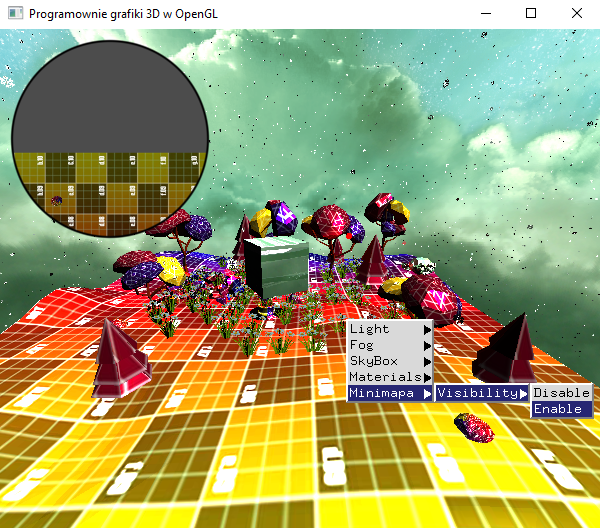

### Zadanie 1

Zaimplementuj minimapę (przykład), która jest wynikiem renderingu sceny z góry w miejscu, w którym znajduje się kamera podstawowa. Obraz w minimapie powinien aktualizować się odpowiednio wraz z poruszaniem się kamery po scenie tak, aby było widać zawsze aktualny widok z góry. Dodaj możliwość włączania/wyłączania minimapy w menu kontekstowym.

Minimapa nie musi być w ramce jak na przykładzie, ale jeśli dodasz jakąś ciekawą to czekają na to dodatkowe punkty. To nie takie trudne, w końcu kilka tekstur już obsługiwaliśmy w obiekcie.

#### Wynik

Na screenie widać scenę z zaimplementowaną minimapą. Jest ona w kształcie koła z czarną cięką gradientową obramówką.

Podgląd menu kontekstowego