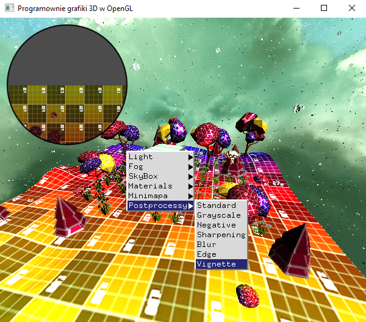

### Zadanie 1

Zaimplementuj postprocessing w swoim projekcie: wybierz dowolne dwa filtry w tym jeden korzystający z metody splotu (konwolucji czy też kernelu). Włączanie/wyłącznie oraz zmianę efektów dodaj do menu kontekstowego. Poprzednie zadanie może być tutaj pomocne, jeśli spojrzymy na to tak, że minimapa powinna być tym razem wyświetlona na całym ekranie.

A może dodasz do swojego postprocessingu dodatkową teksturę z ramką (zobacz przykład).

#### Wynik

Na screenie widać scenę z zaimplementowanymi postprocesowymi filtrami (Grayscale, Negative, Sharpening, Blur, Edge oraz Vignette)

Podgląd menu kontekstowego